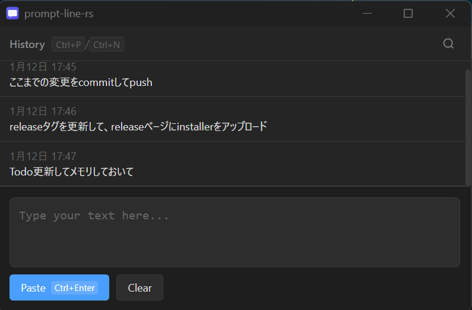

# prompt-line-rs

[English](README.md) | 日本語

Windows向けのフローティングテキスト入力ツール。[prompt-line](https://github.com/nkmr-jp/prompt-line)にインスパイアされています。グローバルホットキーで素早く起動し、テキストを入力して、ワンキーで任意のアプリケーションにペーストできます。



## 特徴

- **グローバルホットキー**: どこからでも`Ctrl+Shift+Space`で起動
- **クイックペースト**: `Ctrl+Enter`でテキストをコピーして直前のアプリにペースト
- **Readlineバインディング**: Emacs風の編集ショートカット（Ctrl+A/E、Ctrl+K/Uなど）
- **履歴ナビゲーション**: `Ctrl+P`/`Ctrl+N`で履歴を移動
- **履歴検索**: `Ctrl+R`で入力履歴を検索
- **システムトレイ**: システムトレイで静かに動作、いつでも準備完了
- **日本語対応**: IMEによる日本語入力を完全サポート
- **カスタマイズ可能**: 設定UIから全てのショートカットを変更可能

## インストール

### インストーラー（推奨）

[リリースページ](https://github.com/jl1nie/prompt-line-rs/releases)からダウンロード:

- **`prompt-line-rs_x.x.x_x64-setup.exe`** - NSISインストーラー（推奨）
- **`prompt-line-rs_x.x.x_x64_en-US.msi`** - MSIインストーラー

### ポータブル版

`prompt-line-rs.exe`をダウンロードして直接実行。インストール不要。

### ソースからビルド

```bash
# リポジトリをクローン
git clone https://github.com/jl1nie/prompt-line-rs.git
cd prompt-line-rs

# 依存関係をインストール
npm install

# リリースビルド
npm run tauri build

# 出力先:
#   src-tauri/target/release/prompt-line-rs.exe
#   src-tauri/target/release/bundle/nsis/*.exe
#   src-tauri/target/release/bundle/msi/*.msi
```

## 使い方

1. **起動**: `prompt-line-rs.exe`を実行（システムトレイにアイコンが表示）
2. **ウィンドウ表示**: `Ctrl+Shift+Space`を押す
3. **入力**: テキストを入力（readlineショートカットで編集可能）
4. **ペースト**: `Ctrl+Enter`で直前のアプリケーションにペースト
5. **履歴移動**: `Ctrl+P`（前）/ `Ctrl+N`（次）
6. **履歴検索**: `Ctrl+R`を押して検索文字を入力
7. **閉じる**: `Escape`で非表示（アプリはシステムトレイに残る）

## キーボードショートカット

### アプリショートカット

| ショートカット       | 動作                                   |
|---------------------|----------------------------------------|
| `Ctrl+Shift+Space`  | ウィンドウの表示/非表示（グローバル）    |
| `Ctrl+Enter`        | テキストをコピーして直前のアプリにペースト |
| `Escape`            | ウィンドウを閉じる / 検索を終了          |

### Readlineバインディング

| ショートカット | 動作              |
|---------------|-------------------|
| `Ctrl+P`      | 前の履歴          |
| `Ctrl+N`      | 次の履歴          |
| `Ctrl+R`      | 履歴検索          |
| `Ctrl+A`      | 行頭へ            |
| `Ctrl+E`      | 行末へ            |
| `Ctrl+B`      | 1文字戻る         |
| `Ctrl+F`      | 1文字進む         |
| `Alt+B`       | 1単語戻る         |
| `Alt+F`       | 1単語進む         |
| `Ctrl+K`      | 行末まで削除      |
| `Ctrl+U`      | 行頭まで削除      |
| `Ctrl+W`      | 1単語削除         |
| `Ctrl+D`      | 1文字削除         |
| `Ctrl+Y`      | ヤンク（貼付）    |
| `Ctrl+L`      | クリア            |

全てのショートカットは設定から変更可能（トレイアイコン右クリック）。

**フォールバックホットキー**: `Ctrl+Shift+Space`が使用できない場合、以下の順で試行:

- `Win+Shift+Space`
- `Alt+Space`
- `Ctrl+Alt+P`

## 設定

設定ファイルの場所:

```text
%APPDATA%\prompt-line\prompt-line-rs\config\config.toml
```

デフォルト設定:

```toml
[shortcuts]
launch = "Ctrl+Shift+Space"
paste = "Ctrl+Enter"
close = "Escape"
history_next = "Ctrl+n"
history_prev = "Ctrl+p"
search = "Ctrl+r"
clear = "Ctrl+l"
# Readlineカーソル移動
line_start = "Ctrl+a"
line_end = "Ctrl+e"
char_back = "Ctrl+b"
char_forward = "Ctrl+f"
word_back = "Alt+b"
word_forward = "Alt+f"
# Readline削除
kill_to_end = "Ctrl+k"
kill_to_start = "Ctrl+u"
kill_word_back = "Ctrl+w"
delete_char = "Ctrl+d"
yank = "Ctrl+y"

[history]
max_entries = 1000

[window]
font_size = 14.0
history_font_size = 12.0
history_lines = 3
textarea_rows = 3
textarea_cols = 60

[behavior]
simulate_paste_shortcut = "Ctrl+V"

[[behavior.app_overrides]]
process_name = "alacritty.exe"
shortcut = "Ctrl+Shift+V"

[[behavior.app_overrides]]
process_name = "wezterm-gui.exe"
shortcut = "Ctrl+Shift+V"
```

### Behaviorセクション

`[behavior]`セクションでは、対象アプリケーションへのペースト方法を設定します:

- **`simulate_paste_shortcut`**: デフォルトのペーストショートカット（デフォルト: `Ctrl+V`）
- **`app_overrides`**: プロセス名に基づくアプリ別ペーストショートカット

これにより、`Ctrl+V`ではなく`Ctrl+Shift+V`を使用する**Alacritty**や**WezTerm**などのターミナルエミュレータにもシームレスにペーストできます。アプリは対象アプリケーションを自動検出し、適切なショートカットを使用します。

## 履歴

履歴の保存先:

```text
%APPDATA%\prompt-line\prompt-line-rs\data\history.jsonl
```

履歴は設定画面からクリアできます（トレイアイコン右クリック → Settings → Clear All History）。

## ユースケース

- CLIベースのAIコーディングエージェント（Claude Code、Gemini CLIなど）
- Enterキーで意図せずメッセージを送信してしまうチャットアプリ
- 入力レスポンスが遅いテキストエディタ
- IMEサポートが限定的なアプリケーションでの日本語入力

## 技術詳細

使用技術:

- **Tauri 2.0**: 軽量デスクトップアプリフレームワーク
- **TypeScript/Vite**: モダンなフロントエンドツール
- **Rust**: ネイティブWindows API統合のバックエンド
- **WebView2**: 最小バンドルサイズのためのシステムWebView

## システム要件

- Windows 10/11 (64-bit)
- WebView2 Runtime（Windows 11には含まれています。Windows 10では自動インストール）

## ライセンス

MIT

## 謝辞

nkmr-jpの[prompt-line](https://github.com/nkmr-jp/prompt-line)にインスパイアされました。
